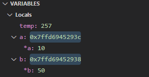
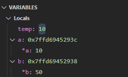
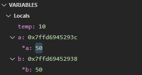
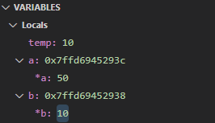

# CS50x Section 4 - Memory

## Pointers

A **pointer** is a variable that **stores** the memory address of another variable as its value. A **pointer variable** points to a variable of the **same data type**, and is created with the `*` operator.

<br>

Let's see **pointers** in action:
```c
int calls = 3;
```
- The `variable` above, like all variables, is a **name** for some **value** that can *change*. Variables are stored in a **hexadecimal addresses** in the computer's memory.

<br>

```c
int *p = &calls;
```
- A `pointer` is an **hexadecimal address** that *references* (points to) another address.

- `int *` is the type.
- `p` is the pointers name.
- `&calls` is the value (variable address) stored in the `p`.

<br>

|Address|Value|Syntax|
|:-:|:-:|:-:|
|0x50000000|**3**|int calls = 3;|
|0x50000004|**0x50000000**|int *p = &calls;|
|0x50000008|...|...|
|0x5000000C|...|...|

<br>

### Key Syntax

- `type *` is a pointer that stores the address of a **type**

- `*x` takes a pointer `x` and gets the value stored at tha address (dereference).

- `&x` takes `x` and gets its address.

<br><br>

Using **pointers** we can pass variables to functions **by reference**, not just **by value**. This will make the code cleaner as a result. 

We also can use **dynamic memory** (e.g., with **malloc**) to write programs that can scale their usage of memory according to user behavior.

<br><br>

## Passing by Copy vs. Passing by Reference

Let's imagine that previously in the `main()` we have declared:
```c
int a = 10;
int b = 50;
```
<br>

Then, we called `swap()` to swap their values:
```c
#include <cs50.h>
#include <stdio.h>

void swap(int a, int b)
{
    int temp = a;
    a = b;
    b = temp;
}
```

```txt
main    a = 10, b = 50

swap    a = 50, b = 10
```

It seems like we achieved the result expected. However, notice that the values of `a` and `b` **remain unchanged** inside the `main()` function. 

This is because the variables `a` and `b` when passed as arguments to the `swap()` function, were **passed by copy**. Manipulating them inside of `swap()` does not affect the **original variables**.

<br><br>

To fix this, we can rewrite `swap()` with **pointers** so we could pass the variables **by reference**:
```c
#include <cs50.h>
#include <stdio.h>

void swap(int *a, int *b)
{
    int temp = *a;
    *a = *b;
    *b = temp;
}
```
```txt
main    a = 50, b = 10
            ^       ^
            ^       ^
swap    a = 50,  b = 10   
```
- This new `swap()` function takes **pointers** to the variables as arguments (the addresses of `a` and `b`).

- It uses **dereference** syntax to access the **actual values** stored in those **addresses** to make permanent changes.

<br>

> [!NOTE]
> We also need to add the `&` **"address of"** operator to `a` and `b` in the function call, to ensure that we pass their **addresses** as arguments:

```c
swap(&a, &b);
```

<br>

Let's see how the full program would look like:
```c
#include <cs50.h>
#include <stdio.h>

// Prototype for swap()
void swap(int *a, int *b);

int main(void)
{
    // Declare and assign values to variables `a` and `b`
    int a = 10;
    int b = 50;

    // Print out values of `a` and `b`
    printf("a is %i, b is %i\n", a, b);

    // Call swap function with addresses(&) of `a` and `b`
    swap(&a, &b);

    // Print out new values of `a` and `b`
    printf("a is %i, b is %i\n", a, b);
}

// The function will take pointers(*) `a` and `b` as arguments
void swap(int *a, int *b)
{
    int temp = *a;
    *a = *b;
    *b = temp;
}
```
```txt
a is 10, b is 50
a is 50, b is 10
```

<br>

### `SWAP()`

We can use `debug50` to **step into** the **swap** function and analyze its inner workings. When the `swap()` function is called in `main()`, the addresses of variables `a` and `b` are passed to it using the **"address of operator"** `&`:

<br>

**1.** `void swap(int *a, int *b)`

<br>



- `temp` holds a **garbage value** of `257`

- Pointer `a` is the address `0x7ffd6945293c`. If we **dereference** (follow) pointer `a` (with operator `*` -> `*a`), we will find it holds value of `10`.

- Pointer `b` is the address `0x7ffd69452938`. If we **dereference** (follow) pointer `b` (`*b`), we will find it holds value of `50`.

<br><br>

**2.** First line `int temp = *a;`

<br>



- Running this line will set the `temp` variable into the result of **dereferencing** the value of pointer `a` (accessing the value it points to), which is `10`.

- `temp` is now `10`.

<br><br>

**3.** Second line `*a = *b;`

<br>



- When this line runs, it will follow the pointer `b` (`*b`) to find the value it is storing, which is `50`.

- Then it will assign the value `50` to the **dereferenced part** of the pointer `a`, replacing the previous value of `10`.

- `*a` is now `50`.

<br><br>

**4.** Third line `*b = temp;`

<br>



- When this line runs, it will set the **dereferencing part** of the pointer `b` to the value of `temp` which is `10`.

- `*b` is now `10`.

<br><br>

**5.** When the `swap()` function is done: 

<br>


- The values stored in the **original variables** `a` and `b` are now swapped at a global level.

<br><br>

The debugging session confirms that the `swap()` function is correctly swapping the values of the variables passed to it **by reference** using **pointers**.

This is reflected in the output produced by the `main()` function, which displays the *updated values* of `a` and `b` after the swap:

```txt
a is 10, b is 50
a is 50, b is 10
```

